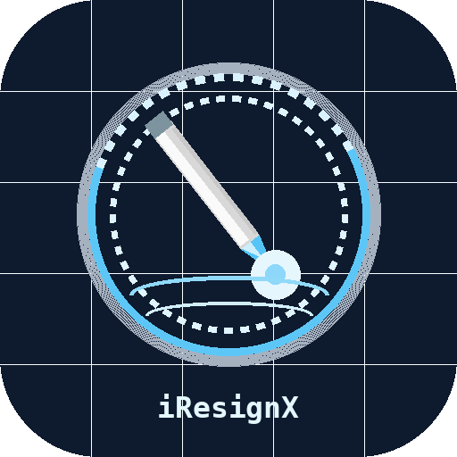
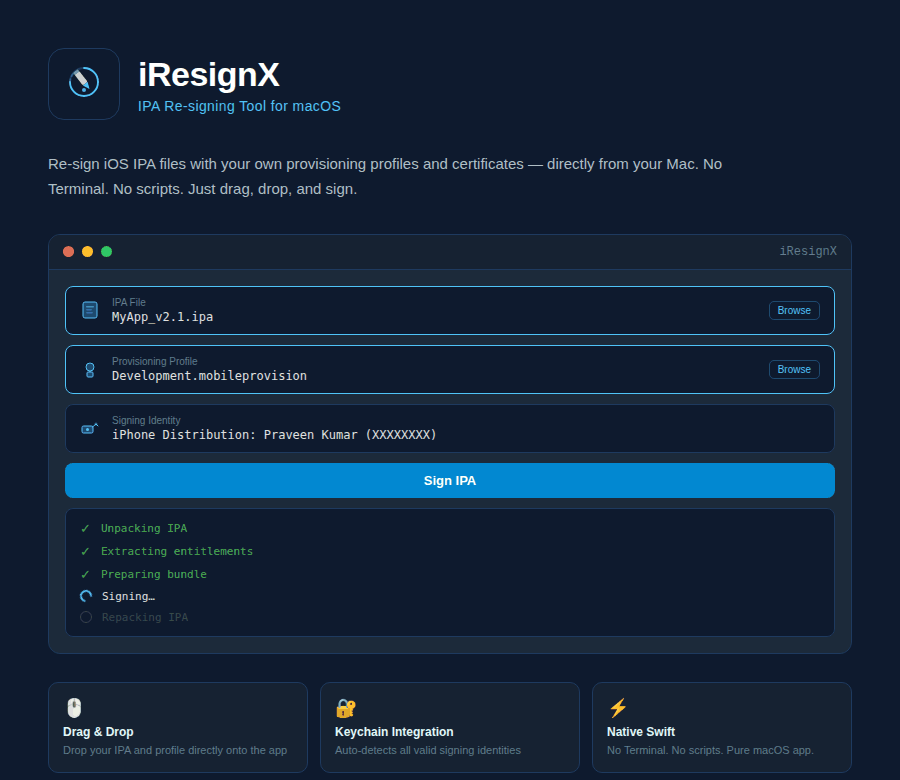
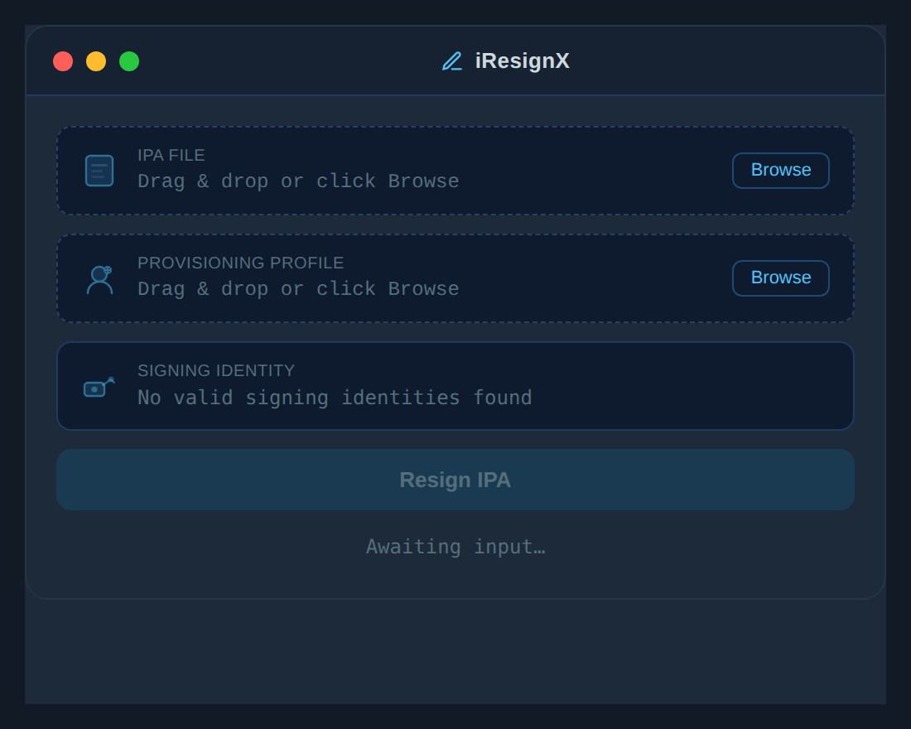
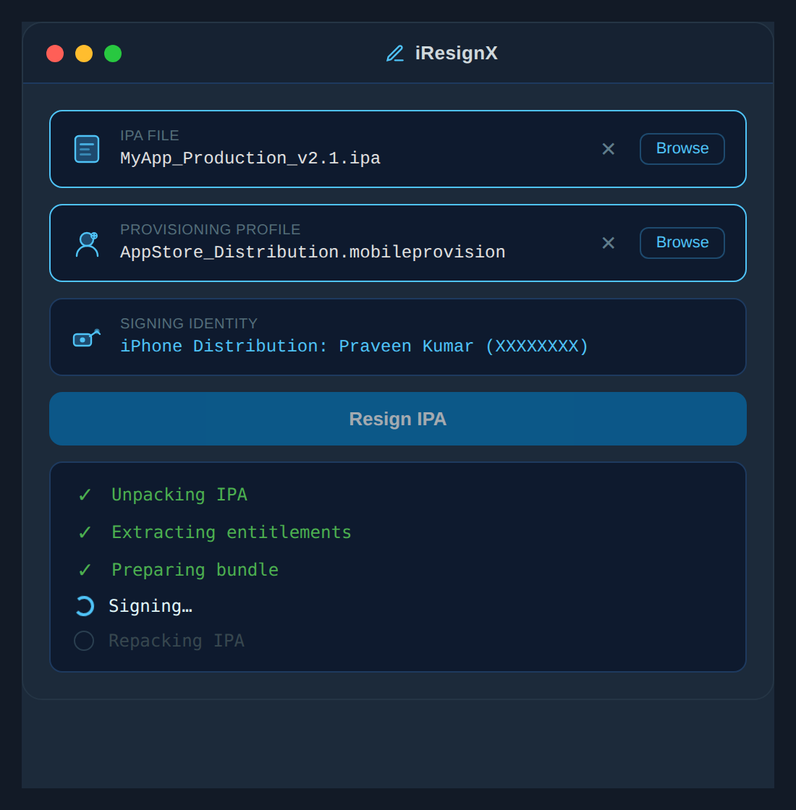
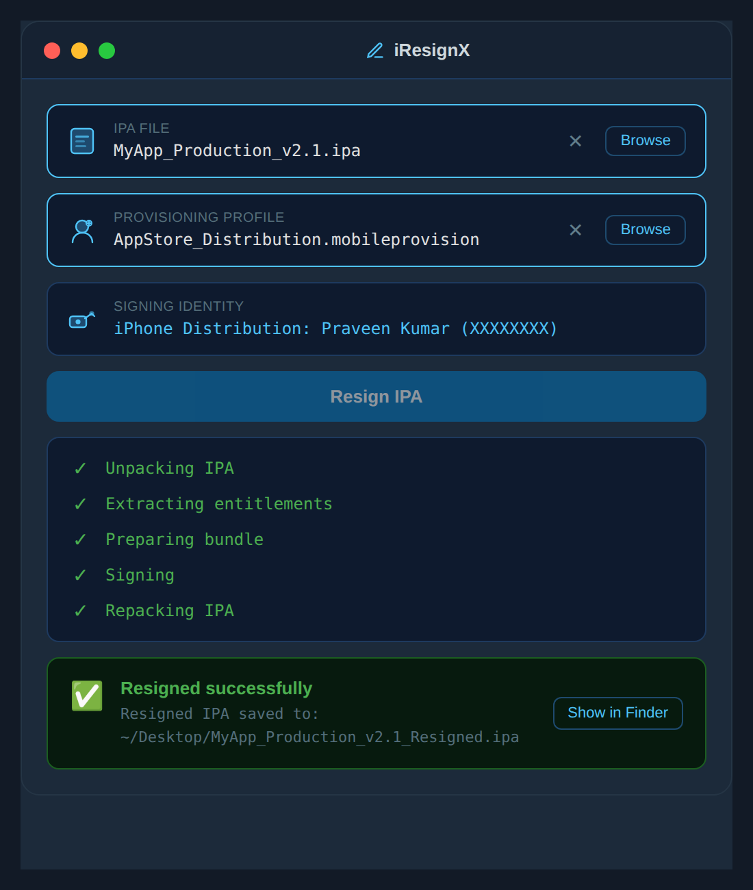

<div align="center">



# iResignX

**A native macOS app for re-signing iOS IPA files**

[](https://www.apple.com/macos/)
[](https://swift.org)
[](LICENSE)
[](https://github.com/spraveenk91/iResignX/stargazers)
[](https://github.com/spraveenk91/iResignX/issues)

Re-sign iOS IPA files with your own provisioning profiles and certificates —  
directly from your Mac. No Terminal. No scripts. Just drag, drop, and sign.



</div>

---

## ✨ Features

- 🖱️ **Drag & Drop** — Drop your `.ipa` and `.mobileprovision` directly onto the app
- 🔑 **Keychain Integration** — Auto-detects all valid signing identities from your Keychain
- 📋 **Step-by-step Progress** — Live indicator for each stage of the signing pipeline
- 🗂️ **Smart File Management** — Writes to `NSTemporaryDirectory`, moves output via `FileManager` (fully sandbox-safe)
- 📂 **Show in Finder** — Jump straight to the resigned IPA after completion
- ⚡ **Native Swift** — Built with `async/await`, `PropertyListSerialization`, and SwiftUI — zero shell hacks
- 🔒 **Sandbox-safe** — No blocked subprocess calls; fully compliant with macOS security model

---

## 📸 Screenshots

<div align="center">

| Main Window | Signing in Progress | Success |
|:-----------:|:-------------------:|:-------:|
|  |  |  |

</div>

---

## 🚀 Getting Started

### Requirements

| Requirement | Version |
|-------------|---------|
| macOS | 14.0 (Sonoma) or later |
| Xcode | 15.0 or later |
| Swift | 5.9 or later |
| Apple Developer Account | Required for signing identities |

### Installation

**Build from source (recommended)**

```bash
# Clone the repository
git clone https://github.com/spraveenk91/iResignX.git

# Open in Xcode
cd iResignX
open iResignX.xcodeproj
```

Then press `⌘ + R` to build and run.

---

## 🛠️ How to Use

**1. Select your IPA file**
Click **Browse** or drag your `.ipa` file onto the IPA row.

**2. Select your Provisioning Profile**
Click **Browse** or drag your `.mobileprovision` file onto the profile row.

**3. Choose a Signing Identity**
iResignX automatically reads all valid `iPhone Distribution` and `Apple Distribution` certificates from your Keychain. Pick the one you want to use from the dropdown.

**4. Click "Resign IPA"**
Watch the step-by-step progress:

```
✓  Unpacking IPA
✓  Extracting entitlements
✓  Preparing bundle
⟳  Signing…
○  Repacking IPA
```

**5. Save & Reveal**
A save dialog appears for you to choose the output location. Once done, click **Show in Finder** to jump straight to the resigned file.

---

## 🏗️ Architecture

```
iResignX/
├── ContentView.swift       # SwiftUI UI — drag & drop, identity picker, progress steps
├── IPAResigner.swift       # Core resign logic — async/await pipeline
└── Assets.xcassets/        # App icons and assets
```

### How the signing pipeline works

```
IPA file
   │
   ▼
Unzip → NSTemporaryDirectory   (FileManager, sandbox-safe)
   │
   ▼
Locate .app bundle inside Payload/
   │
   ▼
Read Info.plist                (PropertyListSerialization — no PlistBuddy)
   │
   ▼
Extract entitlements           (raw CMS byte scan — no `security cms` subprocess)
   │
   ▼
Replace _CodeSignature + embedded.mobileprovision
   │
   ▼
Re-sign Frameworks/ + PlugIns/ + .app    (/usr/bin/codesign)
   │
   ▼
Zip to temp → FileManager.moveItem to save location
   │
   ▼
Cleanup temp dir
```

### Key technical decisions

| Problem | Solution |
|---------|----------|
| `PlistBuddy` blocked by sandbox | `PropertyListSerialization` — native Swift, no subprocess |
| `security cms -D` blocked | Raw byte scan for `<?xml` in `.mobileprovision` binary |
| `zip` subprocess can't write to user-chosen path | Zip to `NSTemporaryDirectory`, then `FileManager.moveItem` |
| `NSSavePanel` must run on main thread | `@MainActor` on `promptSaveLocation` |
| Thread-unsafe `changeCurrentDirectoryPath` | `Process.currentDirectoryURL` per-process |

---

## 🔐 Entitlements

iResignX requires the following entitlements:

```xml
<key>com.apple.security.app-sandbox</key>
<true/>

<key>com.apple.security.files.user-selected.read-write</key>
<true/>
```

No special entitlements beyond standard file access are needed.

---

## 🤝 Contributing

Contributions are welcome! Here's how to get started:

1. **Fork** the repository
2. **Create** a feature branch
   ```bash
   git checkout -b feature/your-feature-name
   ```
3. **Commit** your changes
   ```bash
   git commit -m "feat: add your feature description"
   ```
4. **Push** to your branch
   ```bash
   git push origin feature/your-feature-name
   ```
5. Open a **Pull Request**

### Ideas for contributions

- [ ] Bundle ID override before resigning
- [ ] App name and icon preview from the IPA
- [ ] Resign history / log
- [ ] Support for `.xcarchive` input
- [ ] Batch resign multiple IPAs at once
- [ ] Dark / light mode toggle

Please open an [issue](https://github.com/spraveenk91/iResignX/issues) before starting work on a major feature so we can discuss the approach.

---

## 🐛 Known Issues & Troubleshooting

**"No valid signing identities found"**
> Make sure you have a valid `iPhone Distribution` or `Apple Distribution` certificate installed in your Keychain. Open **Keychain Access** → search for "iPhone Distribution" to verify.

**"Operation not permitted" during unzip**
> The source IPA may be in a restricted location. Move it to your Desktop or Downloads folder and try again.

**Codesign fails with "no identity found"**
> Your certificate may be expired. Check the validity in **Xcode → Settings → Accounts**.

**"Couldn't be moved" when saving**
> Make sure the destination folder exists and you have write permissions to it.

---

## 📄 License

This project is licensed under the **MIT License** — see the [LICENSE](LICENSE) file for details.

```
MIT License — Copyright (c) 2025 Praveenkumar S
```

---

## 👨‍💻 Author

**Praveenkumar S**

[](https://github.com/spraveenk91)

---

## ⭐ Show Your Support

If iResignX saved you time, consider giving it a star — it helps other developers find it!

[](https://github.com/spraveenk91/iResignX/stargazers)

---

<div align="center">
  <sub>Built with ❤️ and Swift · macOS 14+</sub>
</div>
